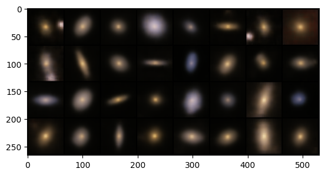
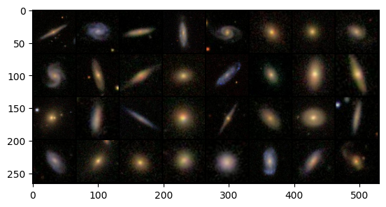

#  Deep Learning Project : Generating galaxy images with a Variational Auto Encoder (VAE)

## LAISNEY Clément, MARMET Hugo, LALOU Quentin - May 2023

This github repository contains the work performed by our group. We built a variational auto-encoder with the goal of generating images of galaxies, using the GalaxyZoo2 image dataset. We first built a VAE of which the encoder and the decoder were both Multi Layer Perceptron, and then where they were both Convolutional Neural Network models.

## Which image contains True galaxies ?

## Files:
[project report](project_report_DL.pdf)